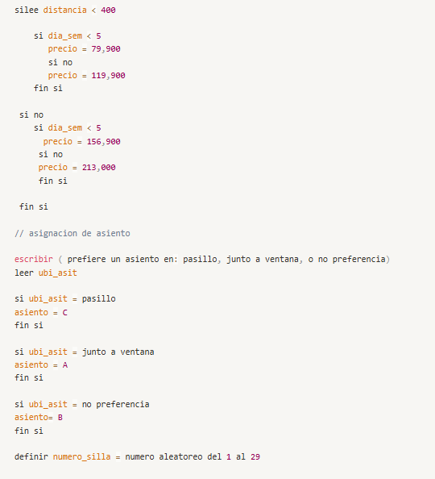

# analisis
## problema 1 

### interpretacion general del problema: 
Lo que podemos observar es una situacion cotidiana en la vida de cualquier persona al momento de disponer del servicio aeronautico para poder viajar a un destino. 
En si lo que se necesita es un archivo llamado <mark>rereservas.py</mark> que sea capaz de poder apartar un vuelo a x ciudad en y dia. Todo funcionara como la pagina de agendamiento de las aerolinias para registrar nuestras reservas, ya que literalmente esto es el sistema que necesitamos.

### explicacion del diagrama: 

Hice una lista de pasos para seguir linealmente el orden de lo que el programa tiene que hacer, primero es necesario que sea capaz de dar una bienvenida al usuario, pero se desea que esta sea algo mas personalizado, por lo que tenemos que saber como referirnos al cliente; entonces se pide su informacion y luego se procede como tal a la reserva del vuelo.

 Se tiene que saber a donde va a viajar entre las opciones disponibles (Medellín, Bogotá, Cartagena) escogera un origen (que no podra cambiar), y un destino; también es necesario el dia del viaje, pero, con solo el dia de la semana y del mes (numero del 1 al 30)  sera suficiente; con todo esto ya podremos calcular el precio siguiendo los criterios que tiene el problema para asignar estos valores.

 Para el asiento se le pregunta al usuario si prefiere un puesto en el pasillo (asiento C), junto a la ventana(asiento A), o si no tiene preferencia (asiento B) 
 para finalizar muestra el nombre completo del usuario, origen, destino, fecha de vuelo, precio del boleto y asiento asignado.

### pseudocodigo

## problema 2

### interpretacion del problema
necesitamos un programa que simule la desintegración orbital de un satélite debido a la resistencia atmosférica.
entonces la situación es la siguiente: el satélite está orbitando la Tierra a una determinada altitud, pierde gradualmente energía y altitud debido a la resistencia atmosférica, La fuerza de arrastre (drag) aumenta a medida que el satélite baja (debido a la mayor densidad atmosférica en las altitudes más bajas). Esto aumenta la tasa de pérdida de altitud. y para terminar eventualmente se estabilizará en una órbita baja o se desintegrará cuando regrese a la atmósfera.
para que el algoritmo funcione se plantea el proceso que observamos en la gráfica, es decir, siguiendo los 3 pasos.

### pseudocodigo 

